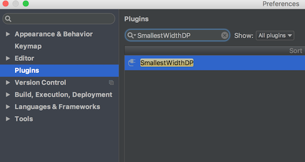
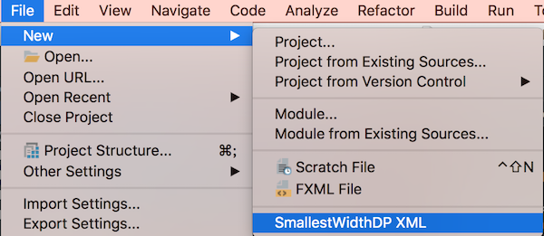
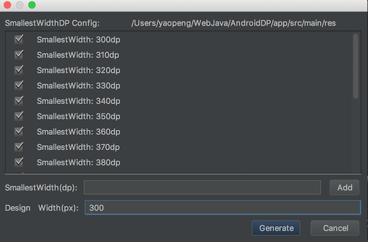

# swdp(SmallestWidthDP)一个稳定和高效的UI适配方案
swdp是一个具有缩放功能的尺寸单位。swdp能够根据屏幕的大小进行缩放。主要用于Android的UI尺寸适配。使用swdp可以很轻松的进行设计稿尺寸到布局尺寸间的映射。如：设计稿标注的尺寸为10px，在布局文件中可以用_10swdp表示。


# 如何使用？
在使用swdp作为布局单位之前，要先使用Android Studio插件生(SmallestWidthDP)成swdp。

1.搜索SmallestWidthDP安装SmallestWidthDP插件。


2.打开SmallestWidthDP，File->New->SmallestWidthDP XML


3.配置SmallestWidthDP，这里SmallestWidth使用默认配置，**design width设置为300**。


4.点击生成按钮，SmallestWidthDP会在{ProjectPath}/app/src/main/res目录项生成values-sw{xx}dp目录及dimen_swdp.xml文件。至此就可以使用swdp作为布局单位进行布局了。如在**design width为300px**的设计稿上，标注为10px尺寸就可以在布局里用_10swdp表示了。


```
android:layout_width="@dimen/_10swdp"
android:layout_height="@dimen/_10swdp"
```

Enjoy!!!


